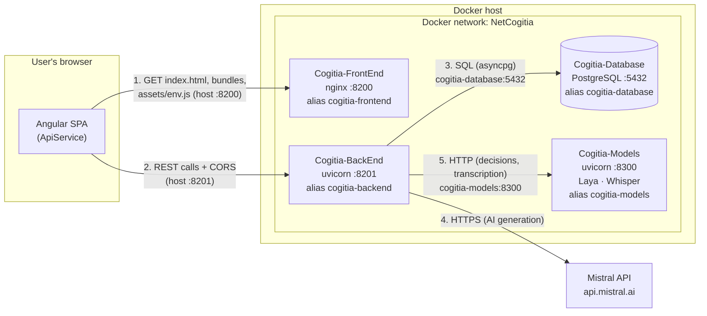
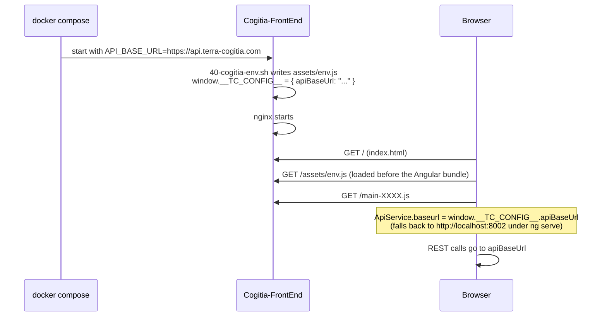
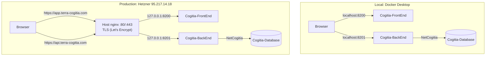
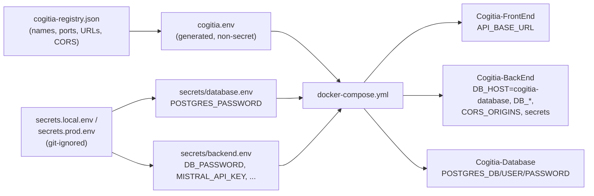
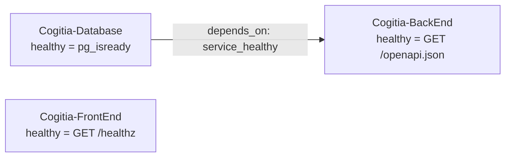

# Terra-Cogitia — Container Architecture

How the Terra-Cogitia containers are built, wired together and reached, locally (Docker Desktop)
and in production (Hetzner). For the commands, see [INSTALLATION.md](INSTALLATION.md).

## 1. The five containers

| Container | Image | Built from | Listens on (inside) | Published on the host | Role |
|---|---|---|---|---|---|
| `Cogitia-FrontEnd` | `cogitia-frontend` | `terracogitia_frontend` (Angular 19) | `8200` | `8200` | Serves the compiled SPA (unprivileged nginx) |
| `Cogitia-BackEnd` | `cogitia-backend` | `terracogitia_backend` (FastAPI) | `8201` | `8201` | REST API: disciplines, themes, questions, challenges, auth, AI layer (routing, prompts, metering, administration) |
| `Cogitia-Models` | `cogitia-models` | `terracogitia_backend/model_server` (FastAPI) | `8300` | **not published** | Open-weight models served to the Back-End: **Laya** (decision model, `POST /v1/decide`), **Whisper** (speech-to-text, `POST /v1/audio/transcriptions`) and **Piper voices** (text-to-speech, `POST /v1/audio/speech`; voice list set by the `PIPER_VOICES` build argument) |
| `Cogitia-Worker` | `cogitia-worker` | `terracogitia_backend` (same code as the Back-End, `--target worker`, adds ffmpeg) | — | **not published** | Media jobs pulled from the PostgreSQL queue: upload processing, transcoding, bank imports, AI generation calls, ffmpeg composition. Scales by replicas. |
| `Cogitia-Database` | `cogitia-database` | `terracogitia_backend/data` (`schema.sql`, `data.sql`) | `5432` | **not published** | PostgreSQL 17, database `terracogitia` |
| `Cogitia-Voice` *(optional)* | `cogitia-voice` | `terracogitia_backend/voice_server` (FastAPI, VibeVoice-1.5B) | `8400` | **not published** | Text-to-speech with **voice cloning**: `POST /v1/audio/speech` (OpenAI-compatible + `reference_audio`). Started only in the environments listing it in `optional_services` (local by default; compose profile `voice`). Separate from Models so a slow synthesis never delays Laya or Whisper. |

All five are on one user-defined Docker network, **`NetCogitia`**, and each has a stable DNS alias on it:

| Container | DNS name on `NetCogitia` |
|---|---|
| `Cogitia-FrontEnd` | `cogitia-frontend` |
| `Cogitia-BackEnd` | `cogitia-backend` |
| `Cogitia-Models` | `cogitia-models` |
| `Cogitia-Worker` | `cogitia-worker` |
| `Cogitia-Database` | `cogitia-database` |

Every name, port and alias is defined once, in [cogitia-registry.json](cogitia-registry.json).

## 2. The key design point: the browser talks to the API

The Front-End is a **pure single-page application**. Its container only serves static files:
it never calls the Back-End itself. The Angular app, **running in the user's browser**, calls the
Back-End directly over HTTP(S).

This is how Terra-Cogitia already worked before Docker (`ApiService.baseurl`), and it was kept.
Consequences:

- The API address must be one the **browser** can reach (`http://localhost:8201` locally,
  `https://api.terra-cogitia.com` in production), **never** an internal Docker name such as
  `cogitia-backend`, which only exists inside `NetCogitia`.
- Because the page and the API have different origins, the Back-End must allow the page's
  origin through **CORS** (`CORS_ORIGINS`).

## 3. Communication paths

| # | From → To | How | Address used | Notes |
|---|---|---|---|---|
| 1 | Browser → Front-End | HTTP(S), via the host port | `http://localhost:8200` / `https://app.terra-cogitia.com` | Static files only; `index.html` and `assets/env.js` are never cached |
| 2 | Browser → Back-End | HTTP(S) + CORS, via the host port | `http://localhost:8201` / `https://api.terra-cogitia.com` | The address comes from `assets/env.js` |
| 3 | Back-End → Database | PostgreSQL protocol on `NetCogitia` | `cogitia-database:5432` | Container-to-container; the only path to the database |
| 4 | Back-End → Mistral | HTTPS, outbound to the internet | `api.mistral.ai` | Needs `MISTRAL_API_KEY` |
| 5 | Back-End → Models | HTTP on `NetCogitia` | `http://cogitia-models:8300/v1` (`AI_MODELS_URL`) | Container-to-container only; optional shared token `MODELS_API_TOKEN` |
| — | Front-End → Back-End | Possible on `NetCogitia` (`http://cogitia-backend:8201`) | — | **Not used by the application**; the scripts only test it to confirm the network works |

Open-weight models run in **`Cogitia-Models`**, not in the Back-End, so CPU-heavy inference never
competes with API requests and the Back-End image stays small (~250 MB instead of ~2 GB):

- **Laya** (Convai Innovations, Apache-2.0) — a *decision* model, open alternative to JEV: a state plus
  typed questions (`choice` / `score` / `noul`) in, typed answers with probabilities out.
  Checkpoint `multilingual` (mmBERT-base, 322M parameters, 100+ languages), pinned commit `LAYA_REVISION`.
- **Whisper** (`base`, MIT) — speech-to-text, OpenAI-compatible endpoint.

Weights are downloaded **at build time** at pinned revisions and baked into the image; the container runs
**offline** (`HF_HUB_OFFLINE=1`) and is reachable only from `NetCogitia`. The Back-End reaches it through
its AI layer (providers « Cogitia-Models » in *Administration › IA*), so a model can later move to a GPU
host or be replaced by a hosted service by configuration. To add a checkpoint, rebuild with
`--build-arg LAYA_MODELS=multilingual,english` (or `WHISPER_MODELS=base,small`).

### How the SPA learns the API address (runtime configuration)

The same Front-End image runs everywhere; the API address is injected **when the container starts**:

### CORS (why the browser is allowed to call the API)

Before calling the API, the browser sends a *preflight* request with its page origin. The Back-End
answers with `Access-Control-Allow-Origin` only if that origin is listed in `CORS_ORIGINS`:

| Environment | Page origin | Allowed origins (`cors_origins` in the registry) |
|---|---|---|
| `ng serve` (dev) | `http://localhost:4200` | default: `:4200` |
| Local Docker | `http://localhost:8200` | `localhost:8200`, `127.0.0.1:8200`, plus `:4200` for `ng serve` |
| Production | `https://app.terra-cogitia.com` | the app domain, plus `http://95.217.14.18:8200` (direct access) |

## 4. Local vs production

| Aspect | Local | Production |
|---|---|---|
| Entry point | Ports 8200/8201 directly | **Host nginx** (outside Docker) on 80/443, proxying to 8200/8201 |
| TLS | none (HTTP) | Let's Encrypt certificate `app.terra-cogitia.com` (covers `app.` and `api.`), issued and renewed by certbot on the host |
| Ports bound to | `127.0.0.1` only (not visible on your LAN) | `0.0.0.0` (8200/8201 also reachable directly by IP) |
| `API_BASE_URL` | `http://localhost:8201` | `https://api.terra-cogitia.com` |
| Images | built on your PC | built on your PC, shipped as `.tar` (`docker save` → SCP → `docker load`) |
| Files | `Installation\.runtime\local\` | `/root/cogitia/` |

To serve production **only** through nginx, set `bind_address` to `127.0.0.1` in the registry;
the scripts then skip the direct-port checks.

The host nginx (`/etc/nginx/.../terra-cogitia.conf`) redirects HTTP to HTTPS and allows 25 MB uploads
(audio) and 900 s timeouts on the API (long Mistral generations). `location /media/uploads` allows
210 MB (video uploads from the Creation Studio) and streams the body to the API without buffering.

**Media worker.** `Cogitia-Worker` shares the Back-End's code, secrets and `backend-data` volume
(media files under `/data/media`), but runs `python -m media.worker` instead of the API. It serves
three job pools (`light`, `provider`, `render`, registry `services.worker.pools`) under a CPU limit
(`services.worker.cpus`), so ffmpeg encoding cannot starve the API or Cogitia-Models. More replicas
can be added without coordination (jobs are claimed with `FOR UPDATE SKIP LOCKED`); running workers on
another host requires moving media files to object storage first. Its health check is a heartbeat file
refreshed every 10 s. API access tokens and media links are signed with `AUTH_SECRET`
(`secrets.<env>.env`, shared by the Back-End and the Worker).

**Cloned voices (optional).** `Cogitia-Voice` holds no state: voice samples live in the Back-End
(`/data/voices`, table `ai_voice_profile` with the consent record) and are sent with each synthesis
request by the Worker. The Back-End reaches it at `AI_VOICE_URL`; `AI_VOICE_ENABLED` seeds the
`vibevoice@voice` deployment as active. It shares the optional `MODELS_API_TOKEN` (`secrets/voice.env`).

## 5. Data and persistence

| Volume | Mounted in | Path | Contents |
|---|---|---|---|
| `cogitia-database-data` | `Cogitia-Database` | `/var/lib/postgresql/data` | All database data |
| `cogitia-backend-data` | `Cogitia-BackEnd` | `/data` (`APP_DATA_DIR`) | Uploaded audio (`/data/audio`), Discover media (`/data/discover_media`) |

- **Seeding:** `schema.sql` then `data.sql` run **only** when the database volume is empty (first start).
  After that, the Back-End applies its own idempotent migrations at every start (`database.py`).
- **Redeploying never touches the volumes.** Only the `-PurgeData` cleanup option deletes them, and it
  takes a `pg_dump` backup first.
- **Backups:** a `pg_dump` is taken before every redeploy. Locally they go to `Installation\backups\local\`,
  on the server to `/root/cogitia/backups/`; the last 5 are kept.

## 6. Configuration and secrets injection

| Container | Receives | Source |
|---|---|---|
| `Cogitia-FrontEnd` | `API_BASE_URL` | registry |
| `Cogitia-BackEnd` | `DB_HOST`, `DB_PORT`, `DB_NAME`, `DB_USER`, `CORS_ORIGINS`, `APP_DATA_DIR` | registry |
| | `DB_PASSWORD`, `MISTRAL_API_KEY`, `MISTRAL_MODEL`, `OPENAI_API_KEY` | secrets file → `secrets/backend.env` |
| `Cogitia-Database` | `POSTGRES_DB`, `POSTGRES_USER` | registry |
| | `POSTGRES_PASSWORD` | secrets file → `secrets/database.env` |

No secret is ever baked into an image or committed. On the server, `secrets/` is `chmod 700` and its
files are `chmod 600`. A container reads its env files **when it is created**, which is why changing an API
key means recreating `Cogitia-BackEnd` (`update-secrets.ps1`), not just restarting it.

## 7. Startup order, health and restarts

- `Cogitia-BackEnd` starts **only after** `Cogitia-Database` is healthy. At startup it opens the
  connection pool and runs its migrations. If the database is unreachable it exits, and Docker restarts it.
- `Cogitia-FrontEnd` is independent: it only serves files.
- Restart policy: **`unless-stopped`** on all four. A crash, or a reboot of the host, brings the
  container back; a deliberate `docker stop` keeps it stopped.

| Container | Health check | Grace period |
|---|---|---|
| `Cogitia-Database` | `pg_isready` | 120 s (first start includes seeding) |
| `Cogitia-BackEnd` | `GET http://127.0.0.1:8201/openapi.json` | 120 s |
| `Cogitia-Models` | `GET http://127.0.0.1:8300/health` | 180 s (models preloaded at start, ~15 s) |
| `Cogitia-FrontEnd` | `GET http://127.0.0.1:8200/healthz` | 10 s |

## 8. Security boundaries

- **The database and Cogitia-Models are not published on the host**: only containers on `NetCogitia`
  can reach them. Cogitia-Models also accepts an optional shared token (`MODELS_API_TOKEN`) and runs
  offline with pinned, baked-in weights (no runtime download).
- `Cogitia-FrontEnd` runs nginx as a non-root user; `Cogitia-BackEnd` runs as user `app` (UID 10001); `Cogitia-Models` as user `models` (UID 10002).
- Images contain no build tools, tests or secrets. Only Cogitia-Models contains PyTorch (CPU-only, GPU-only
  `triton` removed); the Back-End no longer ships any ML library.
- Locally, the ports are bound to `127.0.0.1`. In production, public traffic goes through TLS on the host
  nginx. Note that Docker-published ports bypass `ufw`: use the Hetzner Cloud firewall to restrict 8200/8201.
- **Isolation from other projects:** every script touches only resources named in the registry
  (the four container names, `NetCogitia`, the two volumes) or labelled
  `com.terra-cogitia.project=cogitia` (images). There is no global `docker prune`, so PlanningPowerTools
  and any other containers on the same host are never affected.

## 9. Where each piece is defined

| Piece | File |
|---|---|
| Names, ports, aliases, URLs, CORS, server | [cogitia-registry.json](cogitia-registry.json) |
| Container wiring (network, volumes, env, ports, dependencies) | [docker/docker-compose.yml](docker/docker-compose.yml) |
| Front-End image, SPA server, runtime `env.js` | [docker/frontend.Dockerfile](docker/frontend.Dockerfile), [docker/frontend-nginx.conf](docker/frontend-nginx.conf), [docker/frontend-env.sh](docker/frontend-env.sh) |
| Back-End image | [docker/backend.Dockerfile](docker/backend.Dockerfile) |
| Database image and seed | [docker/database.Dockerfile](docker/database.Dockerfile) |
| Host nginx (production) | [remote/nginx/](remote/nginx/) |
| Server-side operations | [remote/cogitia-remote.sh](remote/cogitia-remote.sh) |
